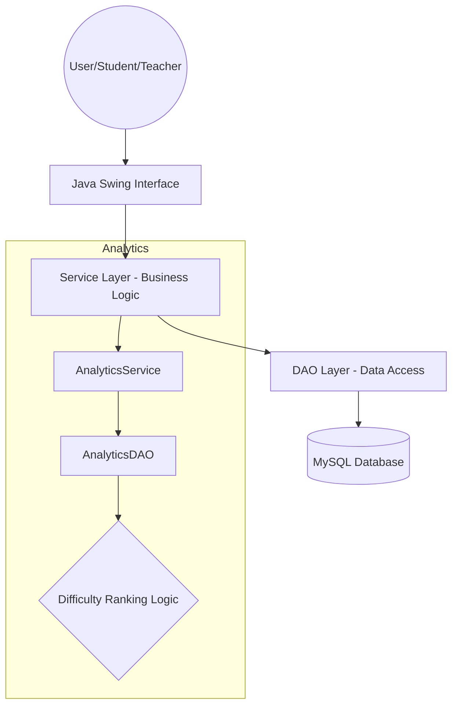
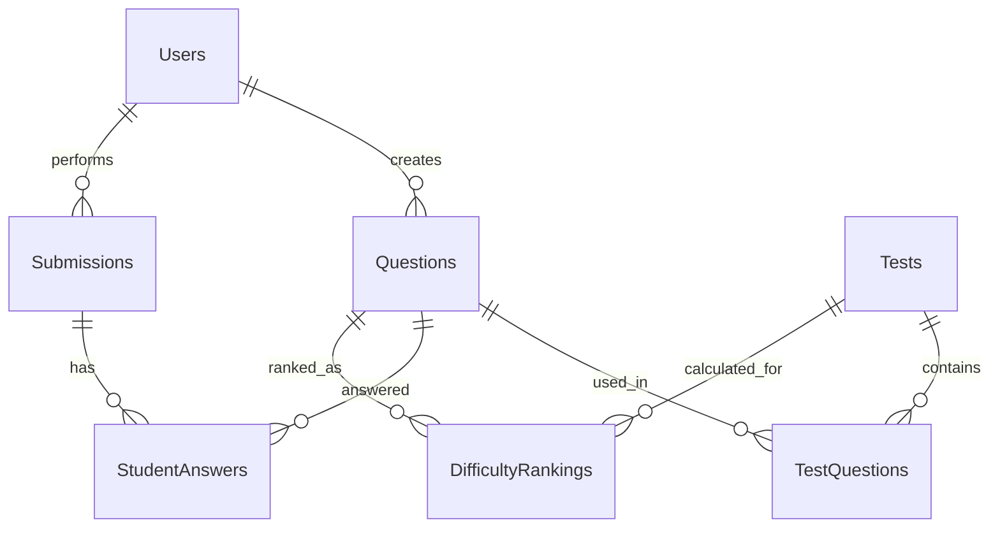

# System Diagrams

This document contains visual representations of the GRE Question Difficulty Ranking Algorithm's architecture and data structure.

## 1. System Architecture

The application follows a standard N-Tier architecture using Java Swing for the frontend and MySQL for the backend.

## 2. Entity Relationship Diagram (ERD)

The core entities involved in the difficulty ranking system.

## 3. Data Flow

1. Student takes a **Test**.
2. **StudentAnswers** are recorded (time, correctness, skip status).
3. **AnalyticsDAO** retrieves performance stats.
4. **Ranking Algorithm** calculates levels.
5. Results are persisted in **DifficultyRankings**.
